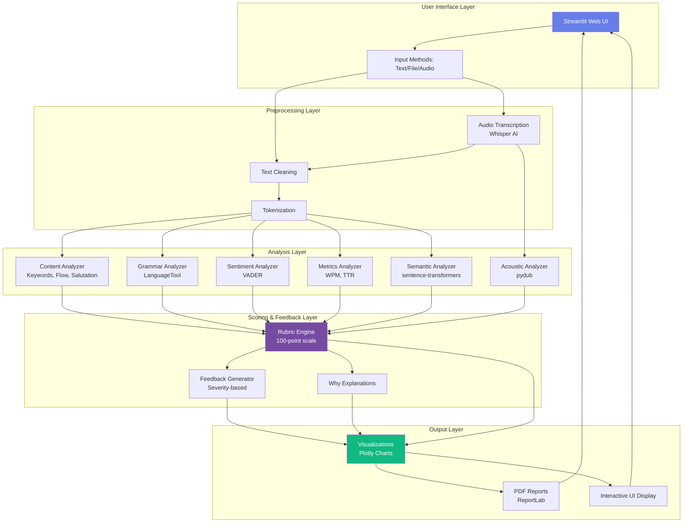
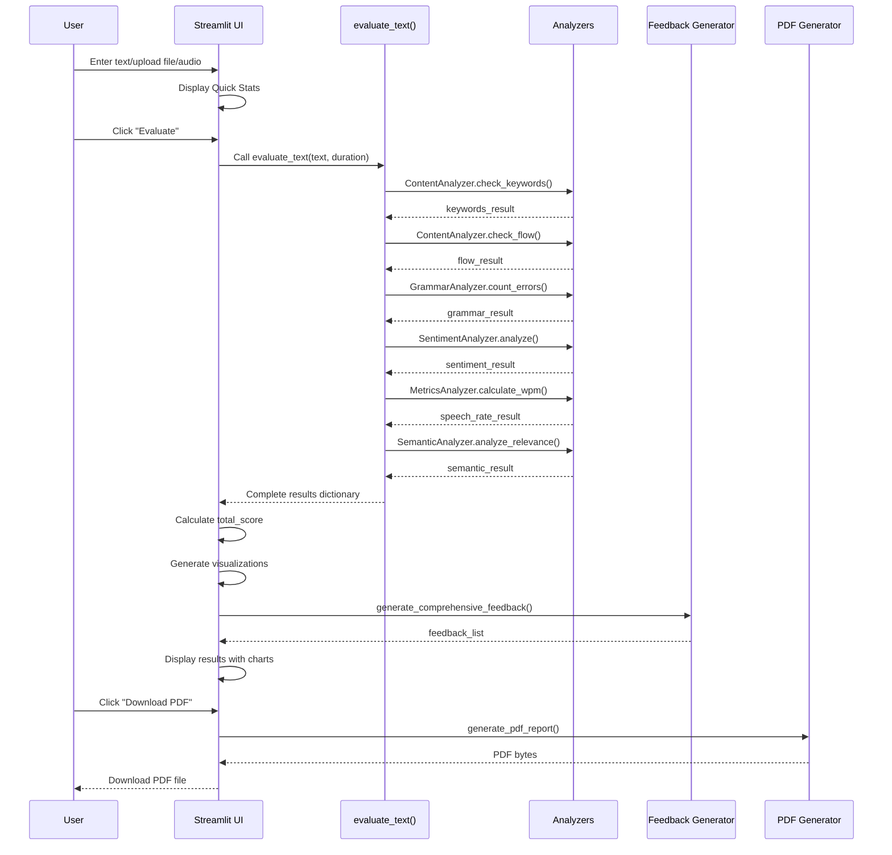

# AI Intro Evaluator 🎓

An advanced AI-powered evaluation system for student self-introductions with a modern web interface. This project evaluates introductions based on various metrics including keyword presence, flow, grammar, vocabulary richness, and sentiment.

## Features ✨

- 🎨 **Modern Web Interface** - Beautiful, responsive Streamlit UI
- 📊 **Interactive Visualizations** - Gauge charts, radar charts, and bar charts
- 📝 **Multiple Input Methods** - Type/paste text or upload files
- 🔍 **Comprehensive Analysis** - Content, grammar, sentiment, and more
- 📥 **Downloadable Reports** - Export detailed evaluation reports
- 💡 **Smart Recommendations** - AI-powered suggestions for improvement

## Project Structure

```
AI Intro Evaluator/
├── src/
│   ├── analyzers/      # Analysis modules
│   │   ├── content.py  # Content & structure analysis
│   │   ├── grammar.py  # Grammar & error checking
│   │   ├── sentiment.py # Sentiment analysis
│   │   └── metrics.py  # Speech rate & vocabulary
│   ├── utils/          # Utility functions
│   └── config.py       # Configuration & keywords
├── data/
│   ├── input/          # Sample input files
│   └── output/         # Generated reports
├── app.py              # Streamlit web application
├── main.py             # CLI evaluation script
└── requirements.txt    # Python dependencies
```

## Installation 🚀

1. **Clone the repository** (or navigate to the project folder)

2. **Create a virtual environment** (recommended):
   ```bash
   python -m venv venv
   venv\Scripts\activate  # On Windows
   ```

3. **Install dependencies**:
   ```bash
   pip install -r requirements.txt
   ```

## Usage 📖

### Web Application (Recommended)

Run the modern web interface:

```bash
streamlit run app.py
```

The app will open in your browser at `http://localhost:8501`

### Command Line Interface

Run the CLI evaluator:

```bash
python src/main.py
```

This will evaluate the sample text in `data/input/sample.txt` and save the report to `data/output/evaluation_report.txt`

## Evaluation Criteria 📋

The system evaluates introductions across 5 main categories (100 points total):

1. **Content & Structure (30 points)**
   - Salutation Level (5 pts)
   - Keyword Presence (30 pts) - Must have: Name, Age, Class/School, Family, Hobbies
   - Flow Analysis (5 pts)

2. **Speech Rate (10 points)**
   - Word count and pacing analysis

3. **Language & Grammar (20 points)**
   - Grammar errors using LanguageTool (10 pts)
   - Vocabulary richness using TTR (10 pts)

4. **Clarity (15 points)**
   - Filler word detection and analysis

5. **Engagement (15 points)**
   - Sentiment and positivity using VADER

## Technologies Used 🛠️

### Core Technologies
- **Streamlit 1.51.0** - Modern web framework for data apps
- **Plotly** - Interactive visualizations (gauge, radar, bar charts)
- **VADER Sentiment** - Rule-based sentiment analysis for social text
- **LanguageTool** - Open-source grammar and style checking
- **NLTK** - Natural language processing toolkit
- **TextStat** - Readability and text statistics

### Advanced Features
- **sentence-transformers** - Semantic similarity using MiniLM
- **OpenAI Whisper** - State-of-the-art speech-to-text
- **ReportLab** - Professional PDF report generation
- **pydub** - Audio file manipulation
- **SpeechRecognition** - Live audio capture

## Architecture & Trade-offs 🏗️

### Why These Technologies?

**Streamlit vs Flask/FastAPI**
- ✅ Chosen Streamlit for rapid prototyping, built-in widgets, and educational focus
- ❌ Trade-off: Less scalable for enterprise use (acceptable for student tool)

**VADER vs Transformer Models**
- ✅ Chosen VADER for speed, interpretability, and lightweight footprint
- ❌ Trade-off: Lower accuracy than BERT/RoBERTa (sufficient for informal introductions)

**LanguageTool vs Grammarly API**
- ✅ Chosen LanguageTool for privacy, zero cost, and offline capability
- ❌ Trade-off: Lower accuracy than commercial tools (acceptable for educational use)

**Whisper (Local) vs Cloud APIs**
- ✅ Chosen Whisper for privacy, accuracy, and zero cost
- ❌ Trade-off: Slower processing on CPU (acceptable for single-user tool)

**sentence-transformers vs spaCy**
- ✅ Chosen sentence-transformers for purpose-built semantic similarity
- ❌ Trade-off: 80MB model size (mitigated with caching)

For detailed architecture and design decisions, see [ARCHITECTURE.md](ARCHITECTURE.md)

## System Architecture 🏗️

### High-Level Architecture



### Data Flow Diagram

```mermaid
flowchart LR
    subgraph Input
        A1[Text Input]
        A2[File Upload]
        A3[Audio Upload]
    end
    
    subgraph Processing
        B1[Text Cleaning]
        B2[Whisper<br/>Transcription]
        B3[Audio Duration<br/>Extraction]
    end
    
    subgraph Parallel_Analysis
        C1[Content<br/>Keywords: 30pts<br/>Flow: 5pts<br/>Salutation: 5pts]
        C2[Grammar<br/>Errors: 10pts]
        C3[Metrics<br/>WPM: 10pts<br/>TTR: 10pts]
        C4[Clarity<br/>Fillers: 15pts]
        C5[Sentiment<br/>Positivity: 15pts]
        C6[Semantic<br/>Coherence]
        C7[Acoustic<br/>Pauses & Pace]
    end
    
    subgraph Scoring
        D1[Total Score<br/>/100]
        D2[Grade<br/>A-F]
    end
    
    subgraph Output
        E1[Gauge Chart]
        E2[Radar Chart]
        E3[Bar Chart]
        E4[Highlighted<br/>Grammar]
        E5[Semantic<br/>Highlighting]
        E6[Feedback<br/>Cards]
        E7[PDF Report]
    end
    
    A1 --> B1
    A2 --> B1
    A3 --> B2
    A3 --> B3
    B2 --> B1
    
    B1 --> C1
    B1 --> C2
    B1 --> C3
    B1 --> C4
    B1 --> C5
    B1 --> C6
    B3 --> C7
    
    C1 --> D1
    C2 --> D1
    C3 --> D1
    C4 --> D1
    C5 --> D1
    
    D1 --> D2
    D1 --> E1
    D1 --> E2
    D1 --> E3
    C2 --> E4
    C6 --> E5
    D1 --> E6
    D1 --> E7
    
    style D1 fill:#667eea,color:#fff
    style D2 fill:#764ba2,color:#fff
    style E7 fill:#10B981,color:#fff
```



### Component Interaction Flow



## Screenshots 📸

The web application features:
- Beautiful gradient UI with modern card design (#667eea to #764ba2)
- Real-time text statistics
- Interactive charts (gauge, radar, bar)
- Detailed score breakdowns with "Why" explanations
- Smart, actionable recommendations
- Downloadable PDF reports
- Audio upload and transcription
- Semantic similarity highlighting
